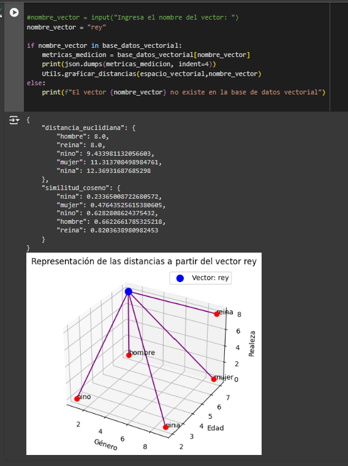

# Embeddings y Base de Datos Vectoriales para NLP

## Introducción

Este repositorio contiene mis soluciones a los ejercicios del curso "Embeddings y Base de Datos Vectoriales para NLP" de Platzi.

## Menú
* [Cálculo de Distancias y Similitudes entre Vectores](#1-cálculo-de-distancias-y-similitudes-entre-vectores)

### 1. Cálculo de Distancias y Similitudes entre Vectores

En este ejercicio, se explora y calcula las relaciones entre palabras utilizando sus representaciones vectoriales. Las métricas utilizadas son la **distancia euclidiana** y la **similitud del coseno**.

#### ¿Qué se hace en este ejercicio?

- **Distancia Euclidiana**: Se calcula la longitud de la línea recta entre pares de vectores que representan palabras. Esta métrica nos ayuda a entender cuán diferentes son dos palabras en un espacio vectorial.

- **Similitud del Coseno**: Se mide el ángulo entre dos vectores para determinar cuán similares son en dirección. Esta métrica es crucial para identificar palabras que tienen significados similares.

- **Combinaciones**: Se generan todas las combinaciones posibles de pares de palabras para calcular las métricas mencionadas. Esto nos permite analizar exhaustivamente las relaciones entre todas las palabras del conjunto.

- **Analisis de una palabra**: Se analiza una palabra dada(puede ser cualquier palabra) y se muestras todas sus metricas con respecto a las otras palabras ordenadas de manera ascendente, es decir de la palabra con mayor similitud a la palabra dada hasta la palabra con menor similitud.

- **Visualización**: Se utiliza la librería `matplotlib` para visualizar las distancias y similitudes entre los vectores.

[Explora el notebook del ejercicio aquí](calculo_distancias_similitudes_vectores.ipynb)

---
